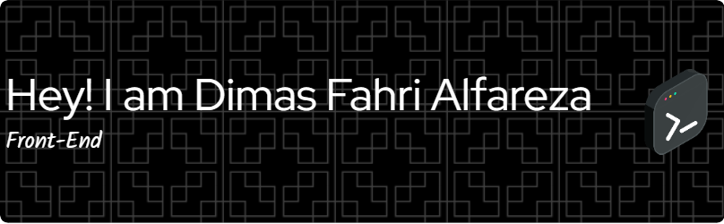

## 🌐 Socials:
   

# 💻 Tech Stack:
          
# 📊 GitHub Stats:
 
 

---

Play games with me!

###

###

<!--
**Alfareza3/Alfareza3** is a ✨ _special_ ✨ repository because its `README.md` (this file) appears on your GitHub profile.

Here are some ideas to get you started:

- 🔭 I’m currently working on ...
- 🌱 I’m currently learning ...
- 👯 I’m looking to collaborate on ...
- 🤔 I’m looking for help with ...
- 💬 Ask me about ...
- 📫 How to reach me: ...
- 😄 Pronouns: ...
- ⚡ Fun fact: ...
-->
<!-- 
- 🔭 I’m currently working on PFSOFT
- 🌱 I’m currently learning PHP native
- 💬 Ask me about Programing 🧑‍💻, Coffe☕ and Football ⚽

### Skills

### Connect With me

### My Github Stats
 -->